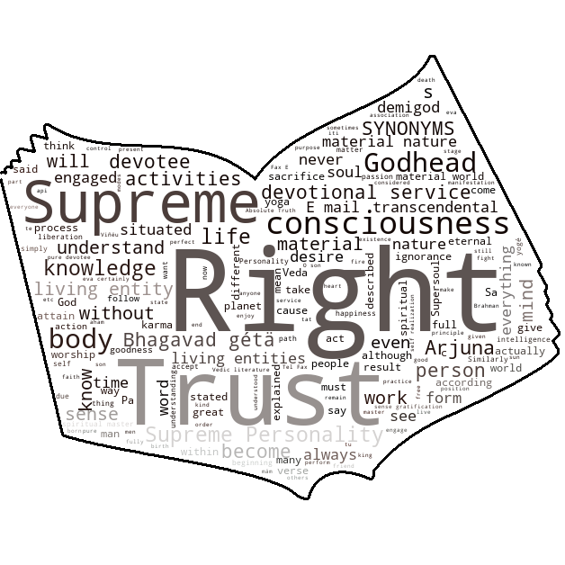

# Make your own Word Cloud
  Steps: 
1. Put your own book/any text file. 
2. Have an image in which you want to put keywords. 
3. Run the code  

## This  

## or this! 

:star: Star me on GitHub — it helps!  

